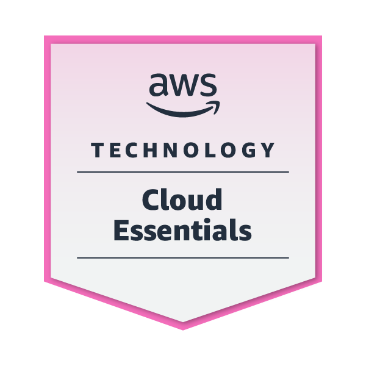
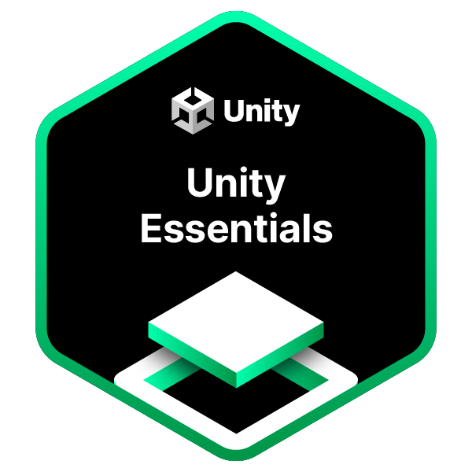
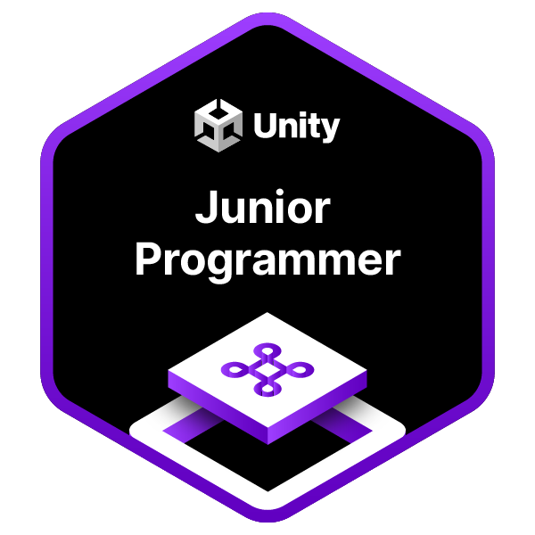

<!---->

About me
---

Passionate about web architectures, I'm currently focused on showcasing my strengths as a backend developer, with a primary emphasis on **`Java Spring Boot`**.

Additionally, I have a fondness for containerization technologies. I've embraced the power of **`Docker`** & **`Kubernetes`** to streamline deployment processes. I also explore **`AWS`** to deepen my cloud expertise.

And let's not forget about game development – it's my secret ingredient for spicing up my skill set! **[My Games](https://github.com/selimsahindev/portfolio)**

Let's collaborate to craft new things! 🌐✨ Reach me on **[LinkedIn](https://www.linkedin.com/in/selim-sahin/)**

<!--

  
  
  

-->

 

